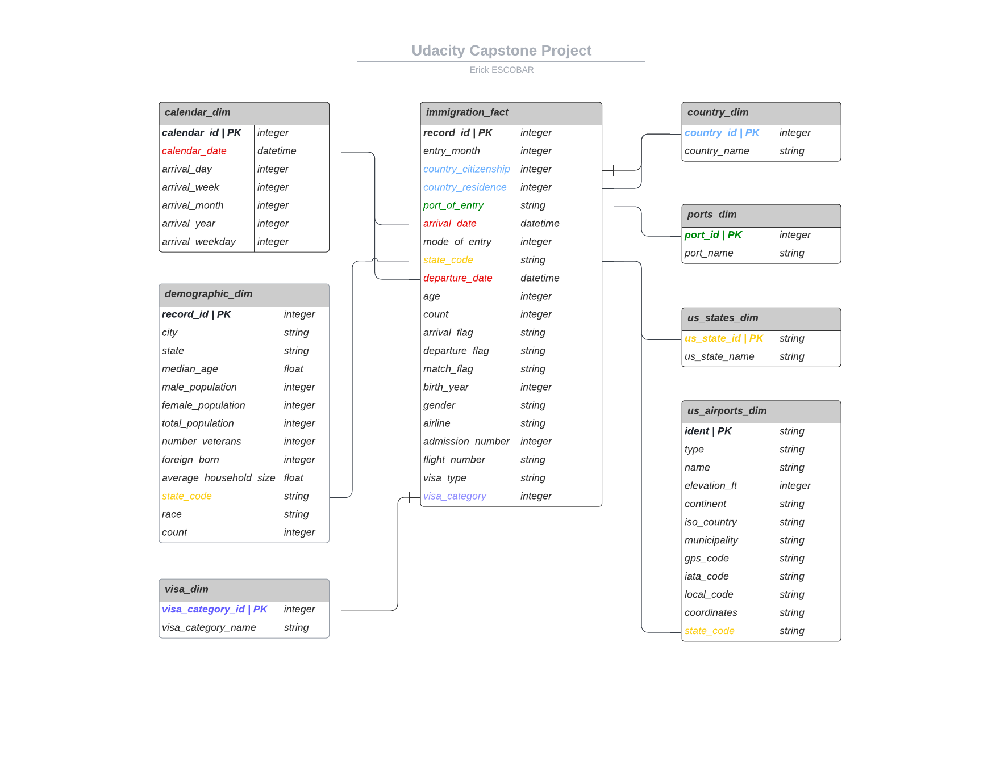
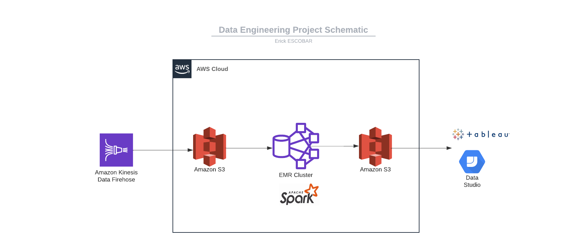

# Capstone Project - Data Engineering Udacity NanoDegree

---

## Table of Contents

---

  * [Project Summary](#Project-Summary)
  * [Scope](#Scope)
  * [Data](#Data)
  * [Data Exploration](#Data-Exploration)
  * [Data Modeling](#Data-Modeling)
  * [ETL](#ETL)
  * [Data Lake](#Data-Lake)
  * [Scenarios](#Scenarios)

## Project Summary

---
The purpose of the data engineering capstone project is to combine the lessons learned throughout the Udacity
Data Engineer Nanodegree program. 

The objective of this project is to create an ETL pipeline for the US I94 immigration, 
Airports information and US demographics datasets to construct an analytical data lake containing 
immigration events.

## Scope

---
This project implements an analytics data lake used ofr the US immigration department to detect immigration pattern,using data
such as airport information and demographics data.
## Data

---
The following datasets were used in this project to construct the data lake:

* `I94 Immigration Data`: This data comes from the US National Tourism and Trade Office. The source of the data is: https://www.trade.gov/national-travel-and-tourism-office
* `US City Demographic Data`: Data obtained from OpenSoft. This data contains demographic information about US cities.
* `Airports Data`: This data comes from the OurAirports and provides airport information for different geographical regions. The source of the data is: https://datahub.io/core/airport-codes#data
## Data Exploration

---

All the information related to the Data Exploration process is provided in the self-contained python notebook file:

    'data_exploration.ipynb'

## Data Modeling

---

The data model consist of the following tables:
* `calendar_dim`: Calendar dimension table, contains information about the calendar. 
* `demographic_dim`: Demographic dimension table, contains information about the demographic data of all the US states.
* `visa_dim`: Visa category dimension table, contains information about the different visa categories.
* `country_dim`: Country dimension table, contains information about the different countries.
* `us_states_dim`: State dimension table, contains information about the different US states.
* `us_airports_dim`: US airports dimension table, contains information about the different US airports.
* `ports_dim`: Ports dimension table, contains information about the ports around the world.

The following image depicts the data model:

## ETL
The ETL process consist of the following steps:

1. Load the data from the source.
* Load the I94 immigration data.
* Load the I94 immigration data labels.
* Load the airport codes data.
* load the US cities demographics.
2. Transform the data.
* Clean and transform the immigration data into the immigration fact table.
* Clean and transform the immigration data labels into the calendar, ports, country, visa and US states dimensional tables.
* Clean and transform the US cities demographics data into the demographics dimensional table.
* Clean and transform the airport codes data into the airports dimensional table.
4. Load the data into the data lake.
5. Perform data quality checks.
6. Perform data analysis.
## Data Lake

The tools used to construct the data lake are:

    * PySpark 
    * Python

The architecture of the data lake is described in the following figure:

The architecture of the data lake describes the production process where the data is captured using AWS Firehose, and the 
capture data is stored in the data lake. Using AWS EMR and spark the data lake is transformed into the corresponding tables of the 
star schema. The resulting tables are created in parquet format and stored in the data lake.

## Scenarios

* [Scenario 1](#Scenario-1): **The data was increased by 100x.** The star schema architecture remains the same in this scenario. Optimizations at RDD level becomes important when the data grows significantly, I'll use broadcasting to distribute the dimensional tables which are considerable smaller than the fact table, so join operations if needed are much faster.
* [Scenario 2](#Scenario-2): **The pipelines were run on a daily basis by 7am.** In order to have complete control of the pipeline, Apache Airflow will be needed, and the configuration for the required schedule has to be done.
* [Scenario 3](#Scenario-3): **The database needs to be accessed by 100+ people.** To comply with Data Governance and Data Privacy, the data lake need to mask certain data fields. Also, the data lake will require specific access permissions, to prevent unauthorized access.

